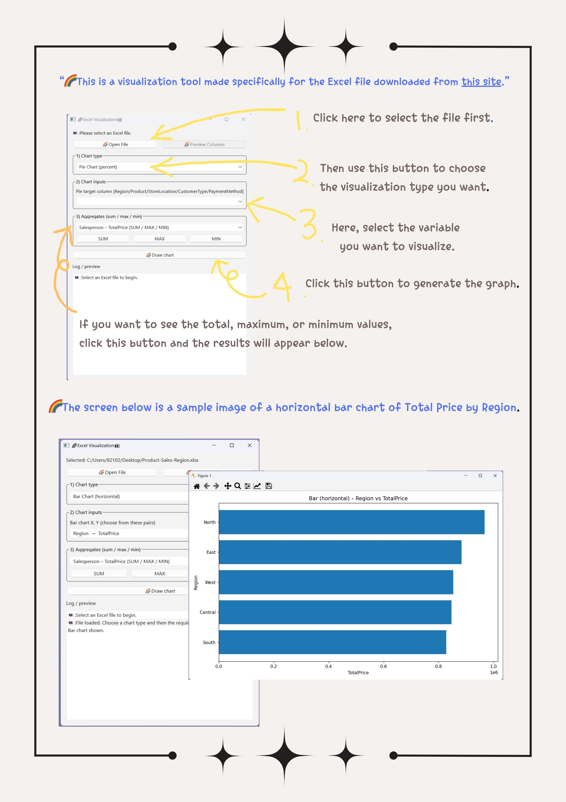

# Excel Visualization Tool

This is a visualization tool made specifically for the [Sales Retail dataset](https://excelx.com/practice-data/sales-retail/).

## Features
- Pie chart of categorical columns (Region, Product, StoreLocation, CustomerType, PaymentMethod)
- Bar charts (vertical/horizontal) for (Region, Quantity), (Region, TotalPrice), (Product, Quantity), (Product, TotalPrice)
- Line chart for numeric columns
- Aggregate calculations: Salesperson–TotalPrice (SUM/MAX/MIN), StoreLocation–Returned (SUM/MAX/MIN)

## How to Use
1. Click **Open File** to select the Excel file.
2. Choose **Chart type**.
3. Select the variable(s).
4. Click **Draw chart** to see the visualization.
5. For totals, maximum, and minimum values, use the buttons in the **Aggregates** section.

## Preview

